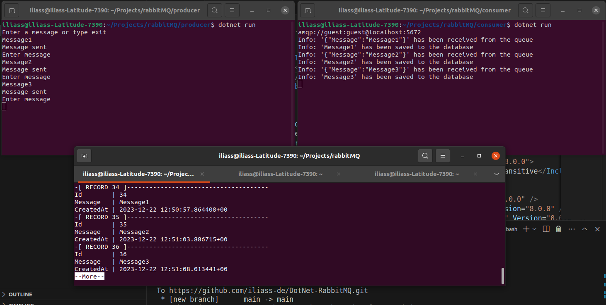

# DotNet-RabbitMQ

I have developed this application using .NET 8, RabbitMQ and PostgreSQL. It consists of two console applications: a producer app that sends messages to the queue, and a consumer app that reads the messages from the queue and stores them in a PostgreSQL database.




## Prerequisites

Before running this application, make sure you have the following installed:

- RabbitMQ server
- .NET 8
- PostgreSQL database

## Installation

1. Clone this repository:

    ```
    git clone https://github.com/iliass-de/DotNet-RabbitMQ.git
    ```

2. Install the required dependencies:

for each application run the following commnand
    ```
    dotnet build
    ```

## Configuration

1. Update the configuration file `appsettings.json` with the appropriate settings for your RabbitMQ server and PostgreSQL database.

## Usage

1. Start the producer application:

    ```
    dotnet run
    ```

2. The producer app will connect to RabbitMQ and ask for user inputs.

3. Start the consumer application:

    ```
    dotnet run
    ```

4. The consumer app will connect to RabbitMQ, read messages from the queue, and store them in the PostgreSQL database.

## Contributing

Contributions are welcome! If you find any issues or have suggestions for improvements, please open an issue or submit a pull request.


